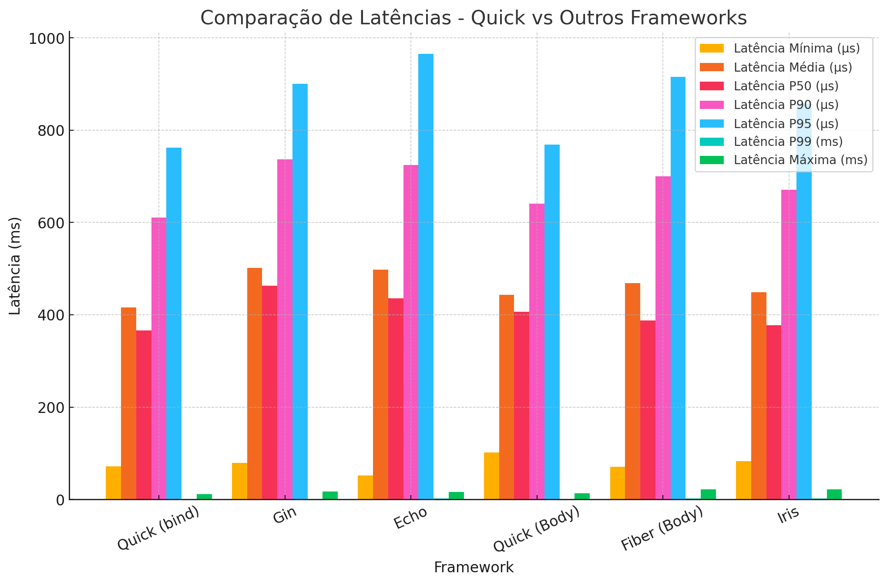
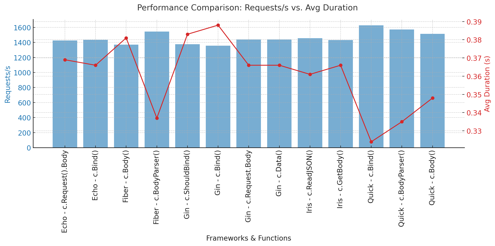

# :rocket: Quick Benchmarking

## Introduction
Welcome to our benchmarking project! Here, we are conducting performance tests to evaluate different HTTP frameworks in Go. The goal is to better understand how each framework performs under heavy loads and identify which one offers the best performance for different scenarios. for acces the quick benchmark [click here](https://github.com/jeffotoni/quick/blob/main/benchmarks/README.md) 

## Tools Used

To ensure accurate and reliable benchmarking, we use two powerful load-testing tools:

## 🔧 Tools Used

| Tool | Purpose | Key Metrics | |
|------|---------|-------------|-
| [k6](https://github.com/goquick-run/benchmarks/blob/main/quick/k6/README.md) | Scenario-based load testing | RPS, Duration, Error Rate | 
| [Vegeta](https://github.com/goquick-run/benchmarks/blob/main/quick/vegeta/README.md) | High-volume HTTP benchmarking | Latency, Percentiles 

## What Are We Measuring?
Our benchmarking evaluates essential metrics, including:
- **Total HTTP Requests**: The total number of processed requests.
- **Requests per Second**: The number of requests handled each second.
- **Average Response Time**: How long the server takes to respond to each request.
- **Data Received and Sent**: The total volume of data transmitted.
- **Error Rate**: The percentage of failed requests.

## Project Structure
The project is organized into directories, each containing its own tests and configurations:

**The graphs below represent the latency comparison with vegeta:**

- **latency comparison with vegeta**
  

:file_folder: **k6/** - Load tests using k6. See the [k6 README](https://github.com/goquick-run/benchmarks/blob/main/quick/k6/README.md) for details.

**The graphs below represent the number of request por second in K6**

- **Number of Requests per Second and Avg Duration (s) In K6**
  

:file_folder: **vegeta/** - Load tests using Vegeta. See the [Vegeta README](https://github.com/goquick-run/benchmarks/blob/main/quick/vegeta/README.md) for details.

## :pushpin: Results  
### Latency Comparison (Vegeta)  
  
- **Fastest**: `Framework quick` (12ms median)  
- **Most Consistent**: `Framework quick` (<5ms variance)  

### Throughput (k6)  
  
- **Highest RPS**: `Framework quick` (18k req/s)  
- **Best Efficiency**: `Framework quick` (14k req/s at 60% CPU)  

## How to Run the Tests?
Each directory contains detailed instructions on how to execute the tests. Simply navigate to the corresponding directory and follow the guidelines.

## Contribution
If you want to contribute with new tests or improvements, feel free to open a PR or share your ideas! :rocket:

---
Let's discover together which framework delivers the best performance! :dart:

